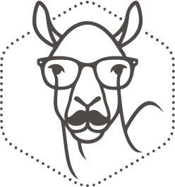

---
#
# By default, content added below the "---" mark will appear in the home page
# between the top bar and the list of recent posts.
# To change the home page layout, edit the _layouts/home.html file.
# See: https://jekyllrb.com/docs/themes/#overriding-theme-defaults
#
layout: home
list_title: "From my blog"
---

<section class="hero">
    

    Designer ∙ Developer ∙ Biker
    <h1 class="hero__title">Hi! I'm Saad    I Create Things That Work for Your Business</h1>
    

    Je suis Saad, passionné de développement web et d'intelligence artificielle.
    

    <a href="/contact/" class="hero__button button button--primary">Let's make dream together</a>
    

</section>

<section class="works">
    

        

            <h2 class="works__title">Selected Work</h2>
            

                <button class="works__nav-button" id="prevButton" onclick="scrollWorks('left')">‹</button>
                <button class="works__nav-button" id="nextButton" onclick="scrollWorks('right')">›</button>
            

        

        

            
            
            

                

                    
                

                

                    {{ work.type }}
                    <h3 class="work__item--title">{{ work.title }}</h3>
                

            

            
        

    

</section>

<!-- Work Modal -->

    

        <h2 class="work-modal__title" id="modalTitle">Work Title</h2>
        <button class="work-modal__close" onclick="closeWorkModal()">×</button>
    

    

        
        Type
        

            Description du projet...
        

        

            <h4>Technologies utilisées</h4>
            
Technologies

            <h4>Durée du projet</h4>
            
Durée

            <h4>Rôle</h4>
            
Rôle

        

        

            <a href="#" id="modalDetailLink" class="button button--primary">Voir plus de détails</a>
        

    

